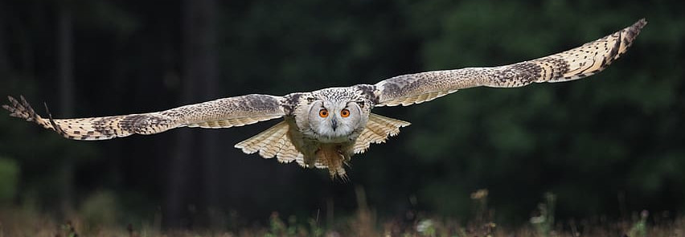

Much like the silent flight of an owl at night, these nodes are configured to
minimize the system noise and let programs run undisturbed. The list of nodes is
`owl[1-2]` and are available for jobs with SLURM.
