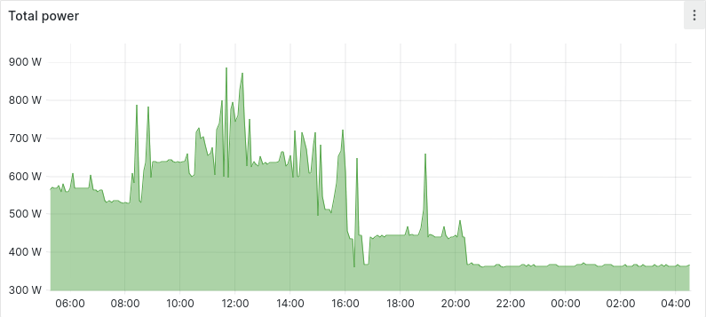

This is a summary of notable changes introduced in the jungle cluster in the
last months.

### New Ceph filesystem available

We have installed the latest [Ceph filesystem][1] (18.2.0) which stores three
redundant copies of the data so a failure in one disk doesn't cause data loss.
It is mounted in /ceph and available for use in the owl1, owl2 and hut nodes.

[1]: https://en.wikipedia.org/wiki/Ceph_(software)

The throughput is limited by the 1 Gigabit Ethernet speed, but should be
reasonably fast for most workloads. Here is a test with dd which reaches the
network limit:

```txt
hut% dd if=/dev/urandom of=/ceph/rarias/urandom bs=1M count=1024
1024+0 records in
1024+0 records out
1073741824 bytes (1,1 GB, 1,0 GiB) copied, 8,98544 s, 119 MB/s
```

### SLURM power save

The SLURM daemon has been configured to power down the nodes after one hour of
idling. When a new job is allocated to a node that is powered off, it is
automatically turned on and as soon as it becomes available it will execute the
job. Here is an example with two nodes that boot and execute a simple job that
shows the date.

```txt
hut% date; srun -N 2 date
2023-09-12T17:36:09 CEST
2023-09-12T17:38:26 CEST
2023-09-12T17:38:18 CEST
```

You can expect a similar delay (around 2-3 min) while the nodes are starting.
Notice that while the nodes are kept on, the delay is not noticeable:

```txt
hut% date; srun -N 2 date
2023-09-12T17:40:04 CEST
2023-09-12T17:40:04 CEST
2023-09-12T17:40:04 CEST
```

### Power and temperature monitoring

In the cluster, we monitor the temperature and the power draw of all nodes. This
allows us to understand which machines are not being used and turn them off to
save energy that otherwise would be wasted. Here is an example where some nodes
are powered off to save energy:



We also configured the nodes to work at low CPU frequencies, so the temperature
is kept low to increase the lifespan of the node components. Towards these
goals, we have configured two alerts that trigger when the CPUs of a node
exceeds the limit temperature of 80 °C or when the power draw exceeds 350 W.

By keeping the power consumption and temperatures controlled, we can safely
incorporate more machines that will only be used on demand.
